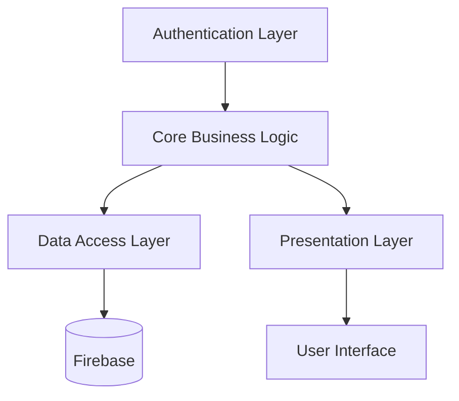

# FlexibleX Payroll System - Technical Documentation

## Getting started

#### Clone repository
`git clone https://github.com/jacques-twizeyimana/flexiblex-frontend.git`

#### Change working directory
`cd flexiblex-frontend`

#### Install dependencies
`npm install`

#### Run local development server
`npm run dev`

#### Build for production
`npm run build`

## System Architecture

### Overview

FlexibleX is built using a modern, component-based architecture following the Single Responsibility Principle. The system is structured into the following main layers:

```
├── Authentication Layer
├── Core Business Logic Layer
├── Data Access Layer
└── Presentation Layer
```

### Component Interaction Diagram



### Key Components

1. **Authentication Layer**
   - Handles user authentication and authorization
   - Manages user sessions and security
   - Components: `Login`, `Signup`, `AuthContext`

2. **Core Business Logic Layer**
   - Manages payroll calculations
   - Handles employee management
   - Processes attendance and leave
   - Components: `PayrollService`, `EmployeeService`, `AttendanceService`

3. **Data Access Layer**
   - Manages data persistence
   - Handles Firebase interactions
   - Components: `firebase.ts`, Data Models

4. **Presentation Layer**
   - Renders UI components
   - Manages state and user interactions
   - Components: `DashboardLayout`, `Modal`, `Forms`

## Technical Specifications

### Frontend Stack

- **Framework**: React 18.3.1
- **Build Tool**: Vite 5.4.2
- **Language**: TypeScript 5.5.3
- **Styling**: Tailwind CSS 3.4.1
- **State Management**: React Context API
- **Form Handling**: Native React Forms

### Backend Services (Firebase)

- **Authentication**: Firebase Auth
- **Database**: Cloud Firestore
- **Storage**: Firebase Storage
- **Hosting**: Firebase Hosting

### Key Dependencies

```json
{
  "dependencies": {
    "react": "^18.3.1",
    "react-dom": "^18.3.1",
    "firebase": "^10.8.0",
    "react-router-dom": "^6.22.2",
    "date-fns": "^3.3.1",
    "lucide-react": "^0.344.0",
    "html2pdf.js": "^0.10.1"
  }
}
```

### Development Dependencies

- ESLint for code quality
- TypeScript for type safety
- Tailwind CSS for styling
- Vite for development and building


## Data Models

### User Model
```typescript
interface User {
  id: string;
  email: string;
  firstName: string;
  lastName: string;
  role: "admin" | "manager" | "user";
  companyId: string;
  createdAt: string;
}
```

### Company Model
```typescript
interface CompanyConfig {
  id: string;
  name: string;
  email: string;
  phone: string;
  address: {
    street: string;
    city: string;
    state: string;
    zipCode: string;
    country: string;
  };
  logo: string;
  dateFormat: "MM/DD/YYYY" | "DD/MM/YYYY" | "YYYY-MM-DD";
  currency: string;
  timezone: string;
}
```

### Employee Model
```typescript
interface Employee {
  id: string;
  firstName: string;
  lastName: string;
  email: string;
  phone: string;
  position: string;
  department: string;
  startDate: string;
  salary: number;
  paymentRate: "hourly" | "monthly";
  status: "active" | "inactive";
  employmentType: "full-time" | "part-time" | "seasonal";
  benefits?: string[];
  deductions?: string[];
}
```

### Leave Model
```typescript
interface Leave {
  id: string;
  employeeId: string;
  startDate: string;
  endDate: string;
  reason: string;
  status: "pending" | "approved" | "rejected";
  isPaid: boolean;
  remarks?: string;
  createdAt: string;
  updatedAt?: string;
  reviewedBy?: string;
}
```

### Attendance Model
```typescript
interface Attendance {
  id: string;
  employeeId: string;
  date: string;
  present: boolean;
  hoursWorked: number;
  companyId: string;
}
```

### Benefit Model
```typescript
interface Benefit {
  id: string;
  name: string;
  type: "fixed" | "percentage";
  value: number;
  description: string;
}
```

### Deduction Model
```typescript
interface Deduction {
  id: string;
  name: string;
  type: "fixed" | "percentage";
  value: number;
  description: string;
}
```

### Invitation Model
```typescript
interface Invitation {
  id: string;
  email: string;
  companyId: string;
  invitedBy: string;
  status: "pending" | "accepted" | "rejected";
  createdAt: string;
  expiresAt: string;
}
```

### Payment Model
```typescript
interface Payment {
  employee: Employee;
  baseSalary: number;
  benefits: {
    name: string;
    amount: number;
  }[];
  deductions: {
    name: string;
    amount: number;
  }[];
  leaveDeductions: LeaveDeduction[];
  totalBenefits: number;
  totalDeductions: number;
  netPay: number;
}
```

### PayrollData Model
```typescript
interface PayrollData {
  id?: string;
  title: string;
  startDate: string;
  endDate: string;
  employees: Payment[];
  companyId: string;
  createdAt: string;
  createdBy: string;
}
```

### TimeRecord Model
```typescript
interface TimeRecord {
  employeeId: string;
  date: string;
  hoursWorked: number;
  overtime: number;
  leave: string | null;
}
```

## Firebase Collections Structure

```
├── users/
│   └── {userId}/
│       ├── firstName
│       ├── lastName
│       ├── email
│       ├── role
│       └── companyId
├── companies/
│   └── {companyId}/
│       ├── name
│       ├── email
│       ├── phone
│       └── address
├── employees/
│   └── {employeeId}/
│       ├── firstName
│       ├── lastName
│       └── ...
├── payrolls/
├── attendance/
└── leaves/
```

## Security Rules

### Firestore Security Rules

```javascript
rules_version = '2';
service cloud.firestore {
  match /databases/{database}/documents {
    // Company access
    match /companies/{companyId} {
      allow read, write: if request.auth != null && 
        (resource.data.ownerId == request.auth.uid ||
         get(/databases/$(database)/documents/users/$(request.auth.uid)).data.companyId == companyId);
    }
    
    // Employee access
    match /employees/{employeeId} {
      allow read, write: if request.auth != null &&
        get(/databases/$(database)/documents/users/$(request.auth.uid)).data.companyId == resource.data.companyId;
    }
  }
}
```

## API Integration Points

### Firebase Authentication

```typescript
// Login
const login = async (email: string, password: string) => {
  return signInWithEmailAndPassword(auth, email, password);
};

// Signup
const signup = async (email: string, password: string, userData: UserData) => {
  const { user } = await createUserWithEmailAndPassword(auth, email, password);
  await setDoc(doc(db, "users", user.uid), userData);
  return user;
};
```

### Firestore Operations

```typescript
// Create
const addDocument = async (collection: string, data: any) => {
  return addDoc(collection(db, collection), {
    ...data,
    createdAt: new Date().toISOString(),
  });
};

// Read
const getDocument = async (collection: string, id: string) => {
  return getDoc(doc(db, collection, id));
};

// Update
const updateDocument = async (collection: string, id: string, data: any) => {
  return updateDoc(doc(db, collection, id), data);
};

// Delete
const deleteDocument = async (collection: string, id: string) => {
  return deleteDoc(doc(db, collection, id));
};
```

## Performance Considerations

1. **Data Fetching**
   - Implement pagination for large data sets
   - Use Firebase query cursors
   - Cache frequently accessed data

2. **Component Optimization**
   - Use React.memo for expensive renders
   - Implement virtualization for long lists
   - Lazy load routes and components

3. **State Management**
   - Use local state for UI-specific data
   - Implement context for shared state
   - Cache Firebase queries

## Deployment

### Production Build

```bash
npm run build
```

### Environment Variables

```env
VITE_FIREBASE_API_KEY=your_api_key
VITE_FIREBASE_PROJECT_ID=your_project_id
```

### Deployment Process

1. Introduce new changes
2. Push to Github
3. Vercel build hooks are automatically triggered
4. If there is error in npm build, debug and repeat the process
5. New version deployed to (flexiblex.vercel.app)[flexiblex.vercel.app]

## Testing Strategy

### Unit Tests

- Test individual components
- Test utility functions
- Test Firebase service wrappers

### Integration Tests

- Test component interactions
- Test Firebase integration
- Test form submissions

## Error Handling

### Client-Side Errors

```typescript
try {
  // Operation
} catch (error) {
  toast.error("User-friendly error message");
  console.error("Detailed error:", error);
}
```

### Firebase Error Codes

```typescript
const handleFirebaseError = (error: FirebaseError) => {
  switch (error.code) {
    case 'auth/wrong-password':
      return 'Invalid password';
    case 'auth/user-not-found':
      return 'User not found';
    default:
      return 'An error occurred';
  }
};
```

## Maintenance and Updates

### Version Control

- Git and Github
- Maintain a changelog
- Document breaking changes

### Code Quality

- Run `npm lint` regulary to check for errors
- Maintain TypeScript types for easy mantainance and collaboration
- Review and update dependencies
